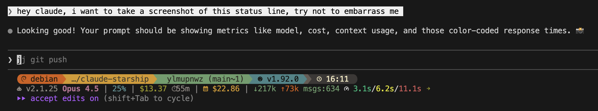

# claude-starship

Integrate Claude Code session metrics into your [Starship](https://starship.rs) shell prompt.



## The Problem

Claude Code can display session metrics via a [status line command](https://docs.anthropic.com/en/docs/claude-code/status-line), passing JSON data through stdin. However, Starship custom modules can't receive stdin—they can only run commands and capture stdout.

## The Solution

This workspace provides two binaries:

1. **claude-starship**: A wrapper that reads Claude Code's JSON from stdin, saves it to a temp file, then `exec`s into `starship prompt`
2. **claude-metric**: A reader that loads the temp file and outputs individual metrics for Starship custom modules

## Installation

```bash
cargo install --git https://github.com/mergeconflict/claude-starship claude-starship
cargo install --git https://github.com/mergeconflict/claude-starship claude-metric
```

Or build from source:

```bash
git clone https://github.com/mergeconflict/claude-starship
cd claude-starship
cargo install --path claude-starship
cargo install --path claude-metric
```

## Configuration

### 1. Configure Claude Code

Add to `~/.claude/settings.json`:

```json
{
  "statusLine": {
    "type": "command",
    "command": "claude-starship"
  }
}
```

### 2. Configure Starship

Add custom modules to `~/.config/starship.toml`:

```toml
# Add claude modules to your format string
format = """
...your existing format...
${custom.claude_model}\
${custom.claude_cost}\
${custom.claude_context}\
"""

[custom.claude_model]
command = "claude-metric model"
when = "printenv CLAUDE_STARSHIP"
format = "[$output]($style) "
style = "bold purple"

[custom.claude_cost]
command = "claude-metric cost"
when = "printenv CLAUDE_STARSHIP"
format = "[$output]($style) "
style = "bold yellow"

[custom.claude_context]
command = "claude-metric context"
when = "printenv CLAUDE_STARSHIP"
format = "[$output]($style) "
style = "bold blue"

[custom.claude_response]
command = "claude-metric response"
when = "printenv CLAUDE_STARSHIP"
style = ""  # Empty style to preserve ANSI colors from command
format = "[$output]($style) "
```

## Available Metrics

| Metric | Example Output | Description |
|--------|----------------|-------------|
| `cost` | `$0.42` | Official session cost from Claude Code |
| `tokens` | `55k` | Total tokens (input + output) |
| `input` | `50k` | Input tokens only |
| `output` | `5k` | Output tokens only |
| `lines` | `+150 -30` | Lines added/removed |
| `model` | `Opus` | Model display name |
| `context` | `28%` | Context window usage |
| `duration` | `45m` | Session wall-clock duration |
| `api` | `12s` | Time spent waiting for API |
| `version` | `1.0.80` | Claude Code version |
| `messages` | `24` | Conversation message count |
| `response` | `3.2s/5.1s/8.4s` | Response time percentiles (p50/p90/p99, color-coded) |
| `block` | `$1.23` | Estimated cost in current 5-hour billing window |
| `today` | `$5.67` | Estimated cost today |

Note: `block` and `today` use our own pricing estimates from the transcript, not official costs.

## How It Works

```
┌─────────────┐     stdin      ┌──────────────────┐
│ Claude Code │ ──────────────>│  claude-starship │
└─────────────┘   (JSON data)  └────────┬─────────┘
                                        │
                                        │ 1. Write JSON to /tmp/claude-starship.json
                                        │ 2. Set CLAUDE_STARSHIP=1 env var
                                        │ 3. exec("starship prompt")
                                        ▼
                               ┌─────────────────┐
                               │    Starship     │
                               └────────┬────────┘
                                        │
                                        │ Runs custom modules
                                        ▼
                               ┌─────────────────┐
                               │  claude-metric  │ ──> Reads temp file, outputs metric
                               └─────────────────┘
```

The `CLAUDE_STARSHIP` environment variable lets Starship's `when` conditions detect that we're inside a Claude Code session, so metrics only appear when relevant.

## License

MIT
